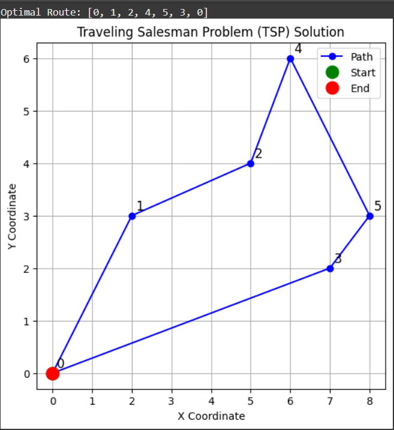

# TSP-problem-using-Google-OR-tools

# 📌 Problem Statement

The Traveling Salesman Problem (TSP) is a classic optimization problem where the objective is to find the shortest possible route that visits each city exactly once and returns to the starting city.

In this project, we solve the TSP using Google OR-Tools and visualize the optimized path with Matplotlib.

# 🛠️ Technologies Used

Python 3

Google OR-Tools

NumPy

Matplotlib

Jupyter Notebook / Google Colab

# 📊 Example Output
Optimized Route Plot:

# ✅ Results

Successfully solved TSP using OR-Tools.

Generated optimized path and distance.

Visualized the path of the salesman across cities.

# 📖 References

(document)[Google OR-Tools Documentation]

(TSP wiki)[Traveling Salesman Problem Wiki]
